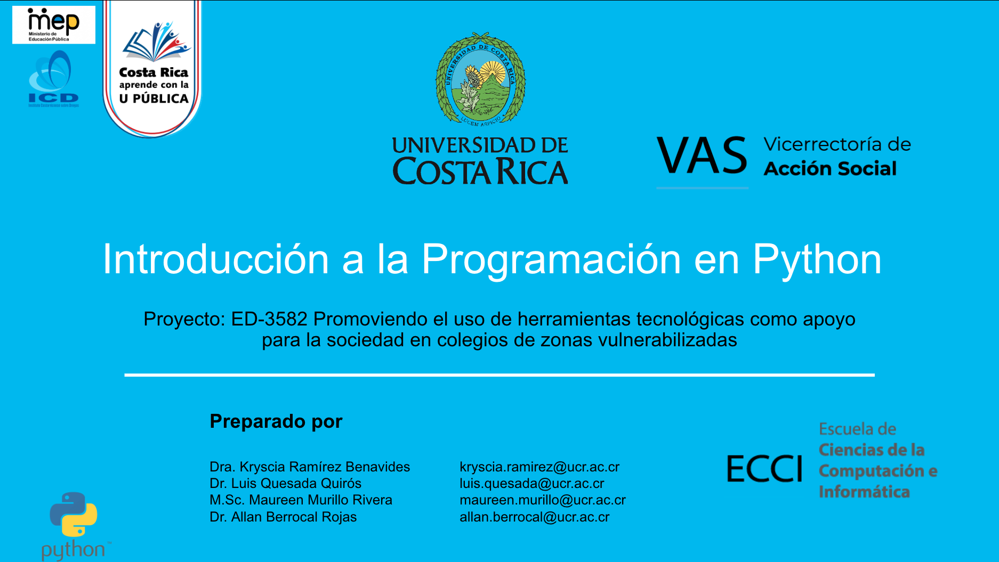

# Descripción

Este es un curso introductorio para el lenguaje de programación Python creado como parte del proyecto de Acción Social ED-3582 de la Escuela de Ciencias de la Computación e Informática de la Universidad de Costa Rica. En este proyecto colaboran Instituto Costarricense sobre Drogas (ICD) y el Ministerio de Educaicón Pública (MEP).

